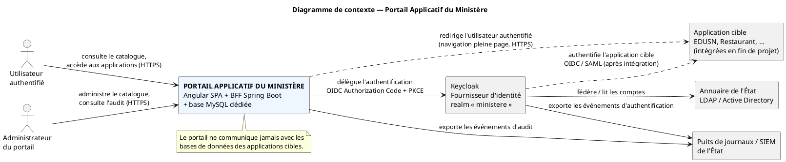
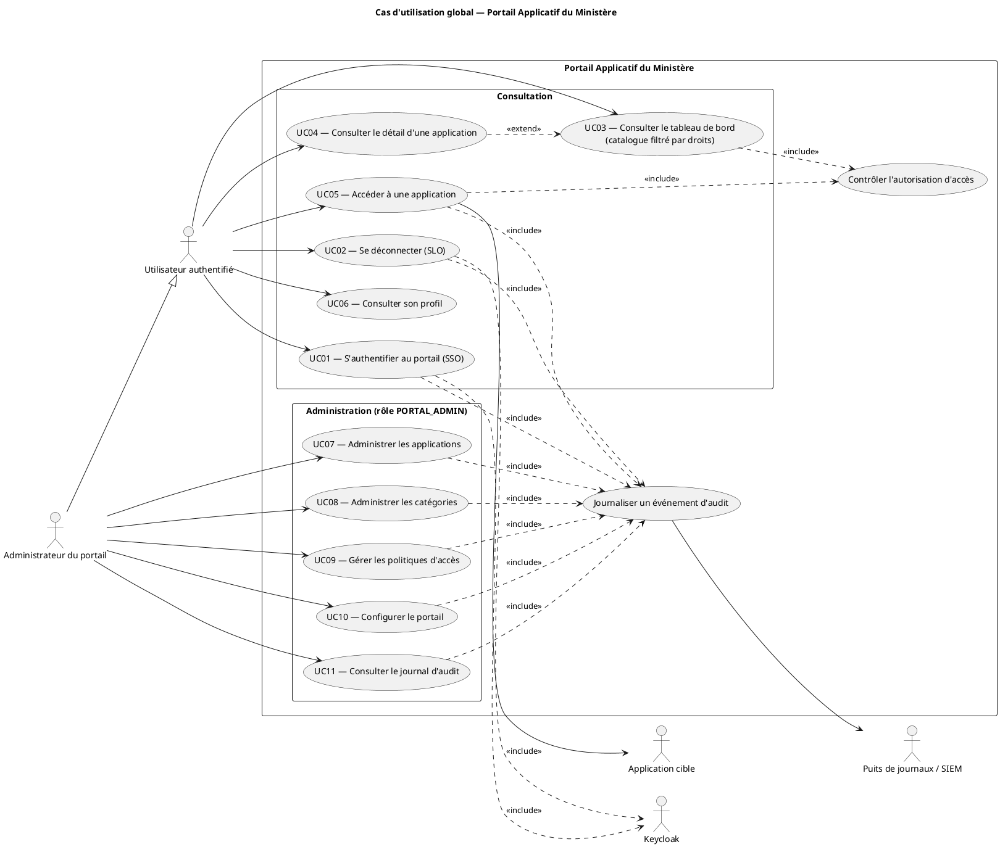

# Cas d'utilisation — Portail Applicatif du Ministère

Statut : **Étape 2 / 8 — Cas d'utilisation** (diagramme de contexte, diagramme de cas
d'utilisation global, fiches détaillées UC01–UC11).

S'appuie sur l'étape 1 : [03-modelisation.md](03-modelisation.md).

Cadre de qualité : application de l'État, **données sensibles**. Chaque cas d'utilisation
explicite ses **exigences de sécurité** (défense en profondeur, moindre privilège,
journalisation systématique, aucune confiance dans le client).

---

## 1. Diagramme de contexte

**Nom.** Diagramme de contexte du système « Portail Applicatif du Ministère ».

**Objectif.** Situer le portail dans le système d'information de l'État : qui l'utilise, de
quels systèmes il dépend, quels flux d'information l'entourent.

**Description.** Le portail est un système autonome. Il délègue l'authentification à Keycloak
(lui-même fédéré sur l'annuaire de l'État). Il redirige les utilisateurs authentifiés vers les
applications cibles. Il exporte ses événements vers le puits de journaux / SIEM de l'État.

**Éléments.**

| Élément | Nature | Rôle |
|---|---|---|
| Utilisateur authentifié | Acteur principal | Consulte le catalogue, accède aux applications |
| Administrateur du portail | Acteur principal | Administre le catalogue, les politiques, consulte l'audit |
| Portail Applicatif du Ministère | Système étudié | Angular SPA + BFF Spring Boot + base MySQL dédiée |
| Keycloak | Système externe | Fournisseur d'identité (realm `ministere`), MFA, émission des jetons |
| Annuaire de l'État (LDAP / AD) | Système externe | Référentiel des comptes, fédéré par Keycloak |
| Application cible (EDUSN, Restaurant, …) | Système externe | Destination des redirections ; intégrée en fin de projet |
| Puits de journaux / SIEM | Système externe | Centralisation et corrélation des événements de sécurité |

**Relations (flux).** Voir les libellés du code PlantUML ci-dessous.

**Justification des choix.**

- Keycloak est représenté **hors** du système étudié : le portail ne réimplémente pas
  l'authentification, il la consomme (RG02).
- L'annuaire de l'État est relié à Keycloak, **pas** au portail : le portail ne connaît jamais
  l'annuaire directement.
- Le SIEM apparaît dès le contexte : la journalisation est une exigence de l'État, pas une
  option.
- Les bases de données des applications cibles n'apparaissent pas : le portail n'a **aucun**
  lien avec elles (contrainte d'indépendance).

**Code PlantUML.**

**Vérification de cohérence.**

- Tous les acteurs du §4 de la modélisation sont présents.
- Aucun flux entre le portail et une base d'application cible.
- Le flux `P ..> APP` est une **redirection** (pointillés), pas un appel d'API métier.
- Keycloak ↔ annuaire : la fédération d'identité est isolée de l'application.

---

## 2. Diagramme de cas d'utilisation global

**Nom.** Diagramme de cas d'utilisation global du portail.

**Objectif.** Recenser toutes les interactions fonctionnelles entre les acteurs et le portail,
réparties en deux domaines : **Consultation** (tout utilisateur) et **Administration** (rôle
`PORTAL_ADMIN`).

**Description.** 11 cas d'utilisation métier + 2 cas d'utilisation transverses inclus
(« Contrôler l'autorisation d'accès », « Journaliser un événement d'audit »). L'administrateur
**hérite** de tous les cas d'utilisation de l'utilisateur authentifié.

**Acteurs / éléments.**

| Acteur | Type | Cas d'utilisation |
|---|---|---|
| Utilisateur authentifié | Principal | UC01–UC06 |
| Administrateur du portail | Principal (spécialise l'utilisateur) | UC01–UC06 + UC07–UC11 |
| Keycloak | Secondaire (système) | UC01, UC02 |
| Application cible | Secondaire (système) | UC05 |
| Puits de journaux / SIEM | Secondaire (système) | tous les UC de sécurité (via « Journaliser un événement ») |

**Relations.**

- `Administrateur --|> Utilisateur authentifié` (généralisation d'acteur).
- `UC01, UC02 ..> Keycloak` : `<<include>>` (le flux d'authentification passe par l'IdP).
- `UC03, UC05 ..> Contrôler l'autorisation d'accès` : `<<include>>`.
- `UC04 ..> UC03` : `<<extend>>` (consulter le détail est une extension optionnelle du
  catalogue).
- `UC05 --> Application cible` (redirection).
- `UC01, UC02, UC05, UC07, UC08, UC09, UC10, UC11 ..> Journaliser un événement d'audit` :
  `<<include>>`.

**Justification des choix.**

- **Pas de `<<include>>` systématique vers UC01** depuis chaque cas d'utilisation :
  l'authentification est une **précondition**, pas une étape répétée ; la surcharger nuirait à
  la lisibilité.
- « Contrôler l'autorisation d'accès » est extrait car il est **réutilisé** (filtrage du
  catalogue **et** accès effectif) et porte une exigence de sécurité forte (contrôle serveur).
- « Journaliser un événement d'audit » est extrait car c'est une obligation transversale de
  l'État, présente dans tous les cas d'utilisation sensibles.
- UC « Refus d'accès » **n'est pas** un cas d'utilisation distinct : c'est le **chemin
  d'exception** de UC05 (voir fiche UC05, E1/E2). En faire un cas séparé créerait un cas sans
  valeur ajoutée pour l'acteur.

**Code PlantUML.**

**Vérification de cohérence.**

- 11 cas d'utilisation = liste §6 de la modélisation, à l'identique.
- Chaque cas d'utilisation a un acteur principal ; chaque acteur a au moins un cas
  d'utilisation.
- Les deux cas transverses sont reliés uniquement par `<<include>>`.
- Aucun cas d'utilisation ne décrit une fonctionnalité métier d'application cible.

---

## 3. Matrices de traçabilité

### 3.1 Cas d'utilisation × acteurs

| Cas d'utilisation | Utilisateur | Administrateur | Keycloak | Application cible | SIEM |
|---|:--:|:--:|:--:|:--:|:--:|
| UC01 S'authentifier | ● | ● | ○ | | ○ |
| UC02 Se déconnecter | ● | ● | ○ | | ○ |
| UC03 Consulter le catalogue | ● | ● | | | ○ |
| UC04 Détail d'une application | ● | ● | | | ○ |
| UC05 Accéder à une application | ● | ● | | ○ | ○ |
| UC06 Consulter son profil | ● | ● | | | |
| UC07 Administrer les applications | | ● | | | ○ |
| UC08 Administrer les catégories | | ● | | | ○ |
| UC09 Gérer les politiques d'accès | | ● | | | ○ |
| UC10 Configurer le portail | | ● | | | ○ |
| UC11 Consulter le journal d'audit | | ● | | | ○ |

● acteur principal ○ acteur secondaire

### 3.2 Cas d'utilisation × règles de gestion

| Cas d'utilisation | Règles de gestion couvertes |
|---|---|
| UC01 | RG01, RG02, RG10, RG15 |
| UC02 | RG15 |
| UC03 | RG03, RG04, RG05, RG09 |
| UC04 | RG03, RG04, RG09 |
| UC05 | RG05, RG06, RG07, RG08, RG09, RG13, RG16 |
| UC06 | RG02 |
| UC07 | RG08, RG09, RG10, RG11, RG12, RG14 |
| UC08 | RG09, RG14 |
| UC09 | RG03, RG09, RG16 |
| UC10 | RG14 |
| UC11 | RG13, RG14 |

Toutes les règles RG01–RG16 sont couvertes par au moins un cas d'utilisation.

### 3.3 Cas d'utilisation × séquences (étape 4 à venir)

| Séquence demandée | Cas d'utilisation source |
|---|---|
| S0 Authentification OIDC / BFF | UC01 |
| S1 Arrivée sur le portail | UC03 |
| S2 Consultation du catalogue / détail | UC03, UC04 |
| S3 Accès à une application (nominal) | UC05 |
| S4 Accès sous contrôle d'accès | UC05 + « Contrôler l'autorisation d'accès » |
| S5 Refus d'accès | UC05 (E1/E2) |
| S6 Administration du catalogue | UC07 à UC10 |

---

## 4. Fiches détaillées des cas d'utilisation

Modèle commun : Objectif · Acteurs · Préconditions · Déclencheur · Postconditions ·
Scénario nominal · Alternatives (A) · Exceptions (E) · Règles de gestion · Exigences de
sécurité · Fréquence / criticité.

---

### UC01 — S'authentifier au portail (SSO)

**Objectif.** Établir une session authentifiée sur le portail via Keycloak, sans jamais exposer
de jeton au navigateur.

**Acteurs.** Principal : Utilisateur authentifié. Secondaires : Keycloak, SIEM.

**Préconditions.** L'utilisateur possède un compte actif dans Keycloak ou l'annuaire fédéré ;
le portail et Keycloak sont en service ; l'échange se fait en TLS.

**Déclencheur.** L'utilisateur demande une page protégée du portail sans session valide.

**Postconditions (succès).** Session serveur (BFF) créée ; cookie `httpOnly` + `Secure` +
`SameSite` posé ; contexte d'identité (claims) disponible côté serveur ; événement `CONNEXION`
(SUCCES) journalisé et exporté au SIEM.

**Scénario nominal.**

1. L'utilisateur demande une page protégée.
2. Le BFF constate l'absence de session et initie le flux **OIDC Authorization Code + PKCE**
   vers Keycloak (`state` et `nonce` générés).
3. Keycloak authentifie l'utilisateur : identifiants + **MFA** selon la politique du realm.
4. Keycloak redirige vers l'URL de rappel du BFF avec un `code` d'autorisation.
5. Le BFF vérifie `state`, échange le `code` contre les jetons **par canal arrière**, valide
   l'`id_token` (signature JWKS, `iss`, `aud`, `exp`, `nonce`).
6. Le BFF crée la session serveur, pose le cookie, **ne transmet aucun jeton** au navigateur.
7. Le BFF journalise `CONNEXION` (SUCCES) et redirige vers la page initialement demandée.

**Alternatives.**

- **A1 — Session SSO déjà active chez Keycloak.** L'étape 3 est transparente : l'utilisateur
  n'a pas à ressaisir ses identifiants (véritable authentification unique).
- **A2 — MFA à enrôler.** Keycloak impose l'enrôlement d'un second facteur (OTP / WebAuthn)
  avant de délivrer le `code`.

**Exceptions.**

- **E1 — Identifiants invalides.** Keycloak refuse ; après N tentatives, verrouillage
  progressif (protection anti-force brute). Message générique, sans divulgation.
- **E2 — Compte désactivé ou expiré.** Accès refusé, message neutre, événement d'échec
  journalisé côté Keycloak.
- **E3 — Échec de validation du jeton côté BFF.** Aucune session créée ; HTTP 401 ; événement
  `ERREUR` ; alerte SIEM.
- **E4 — Keycloak indisponible.** Page d'erreur maîtrisée ; **aucune** dégradation vers un mode
  non authentifié.

**Règles de gestion.** RG01, RG02, RG10, RG15.

**Exigences de sécurité.**

- Flux **Authorization Code + PKCE** exclusivement ; flux implicite interdit.
- `state` (anti-CSRF) et `nonce` (anti-rejeu) vérifiés systématiquement.
- Aucun jeton en `localStorage` / `sessionStorage` ; session portée par cookie serveur.
- Cookie `HttpOnly`, `Secure`, `SameSite=Lax` au minimum, préfixe `__Host-`.
- Durée de session inactive courte ; **durée absolue plafonnée** ; rotation du jeton de
  rafraîchissement côté BFF.
- Journalisation horodatée avec identifiant de corrélation ; pas de secret dans les logs.

**Fréquence / criticité.** Très fréquent / **critique**.

---

### UC02 — Se déconnecter (déconnexion centralisée)

**Objectif.** Terminer la session du portail et propager la déconnexion à Keycloak (et aux
applications de la session, si le back-channel logout est configuré).

**Acteurs.** Principal : Utilisateur authentifié. Secondaires : Keycloak, SIEM.

**Préconditions.** Session active.

**Déclencheur.** Clic « Se déconnecter » **ou** expiration de session.

**Postconditions (succès).** Session BFF **invalidée côté serveur** ; cookie supprimé ;
`RP-Initiated Logout` envoyé à Keycloak ; événement `DECONNEXION` journalisé.

**Scénario nominal.**

1. L'utilisateur clique « Se déconnecter ».
2. Le BFF invalide la session serveur et supprime le cookie.
3. Le BFF redirige vers l'`end_session_endpoint` de Keycloak avec `id_token_hint`.
4. Keycloak clôt la session SSO et, si configuré, déclenche le **back-channel logout** vers les
   applications clientes.
5. Retour sur la page publique du portail ; `DECONNEXION` (SUCCES) journalisé.

**Alternatives.**

- **A1 — Déconnexion par expiration.** Identique sans action de l'utilisateur ; message
  « session expirée » puis redirection vers UC01.

**Exceptions.**

- **E1 — Keycloak injoignable.** La session **locale est tout de même détruite** ; un
  avertissement est journalisé ; l'utilisateur est informé qu'une session SSO résiduelle peut
  subsister.

**Règles de gestion.** RG15.

**Exigences de sécurité.**

- Invalidation **côté serveur** (pas seulement suppression du cookie) : un cookie rejoué ne
  doit rien réouvrir.
- Pas de mise en cache de la page post-déconnexion (`Cache-Control: no-store`).
- Journalisation systématique.

**Fréquence / criticité.** Fréquent / élevé.

---

### UC03 — Consulter le tableau de bord (catalogue filtré par droits)

**Objectif.** Présenter à l'utilisateur **uniquement** les applications qu'il est autorisé à
voir.

**Acteurs.** Principal : Utilisateur authentifié. Inclus : « Contrôler l'autorisation
d'accès ». Secondaire : SIEM.

**Préconditions.** Utilisateur authentifié (UC01).

**Déclencheur.** Arrivée sur la page d'accueil du portail.

**Postconditions (succès).** Liste des applications visibles renvoyée, triée par catégorie puis
`ordreAffichage` ; événement `CONSULTATION_CATALOGUE` journalisé (échantillonnage possible pour
limiter le volume).

**Scénario nominal.**

1. Le navigateur demande le catalogue au BFF (cookie de session).
2. Le service construit `IdentiteUtilisateur` à partir des claims du jeton.
3. Pour chaque application **non archivée** et **non `MASQUEE`**, le service évalue les
   `PolitiqueAcces` (algorithme §7.4 de la modélisation : `REFUSER` prime, sinon `AUTORISER`
   ou `OUVERT_A_TOUS`).
4. Le service renvoie les applications autorisées avec leur `statut`.
5. L'interface affiche les cartes ; pour les applications `MAINTENANCE` / `INDISPONIBLE`, le
   bouton « Accéder » est désactivé et un bandeau informatif est affiché.

**Alternatives.**

- **A1 — Aucune application autorisée.** Message « Aucune application n'est disponible pour
  votre profil ».

**Exceptions.**

- **E1 — Service catalogue indisponible.** Message d'erreur ; **aucun** cache d'autorisation
  périmé n'est servi.

**Règles de gestion.** RG03, RG04, RG05, RG09.

**Exigences de sécurité.**

- Filtrage réalisé **côté serveur** ; l'interface ne reçoit jamais les applications non
  autorisées.
- Aucune fuite de l'existence d'applications `MASQUEE`.
- En-têtes anti-cache sur la réponse du catalogue (contenu personnalisé).

**Fréquence / criticité.** Très fréquent / élevé.

---

### UC04 — Consulter le détail d'une application

**Objectif.** Afficher les informations d'une application : nom, description, catégorie,
statut, icône, informations utiles.

**Acteurs.** Principal : Utilisateur authentifié.

**Préconditions.** L'application fait partie du périmètre visible de l'utilisateur (UC03).

**Déclencheur.** Clic sur une carte / « En savoir plus ».

**Postconditions (succès).** Fiche affichée ; `CONSULTATION_APPLICATION` journalisé.

**Scénario nominal.**

1. Le navigateur demande le détail par `code`.
2. Le service **revérifie la visibilité** (RG09), indépendamment de l'affichage précédent.
3. Le service renvoie les métadonnées de l'entrée de catalogue.
4. L'interface affiche la fiche.

**Alternatives.** Aucune.

**Exceptions.**

- **E1 — Application inconnue ou non visible pour l'utilisateur.** HTTP **404 indifférencié**
  (aucune distinction entre « inexistante » et « interdite »).

**Règles de gestion.** RG03, RG04, RG09.

**Exigences de sécurité.**

- Réponse 404 identique pour « inexistante » et « non autorisée » (pas d'énumération).
- L'`urlAcces` n'est pas nécessaire à l'affichage de la fiche : ne l'exposer qu'au moment du
  déclenchement de l'accès (UC05).

**Fréquence / criticité.** Fréquent / modéré.

---

### UC05 — Accéder à une application

**Objectif.** Rediriger l'utilisateur authentifié **et autorisé** vers l'application cible, en
pleine page, sans encapsulation.

**Acteurs.** Principal : Utilisateur authentifié. Inclus : « Contrôler l'autorisation
d'accès », « Journaliser un événement d'audit ». Secondaires : Application cible, SIEM.

**Préconditions.** Utilisateur authentifié ; application non archivée.

**Déclencheur.** Clic « Accéder » sur une carte.

**Postconditions (succès).** URL canonique de l'application renvoyée ; événement
`ACCES_APPLICATION_AUTORISE` journalisé ; le navigateur effectue une **navigation pleine page**
vers l'application.

**Scénario nominal.**

1. Le navigateur appelle `POST /acces/{code}` au BFF (jeton **CSRF** requis).
2. Le service charge l'application par `code` ; vérifie : non archivée, `statut = ACTIVE`.
3. Le service exécute **« Contrôler l'autorisation d'accès »** (évaluation des `PolitiqueAcces`
   sur `IdentiteUtilisateur`).
4. Le service valide que `urlAcces` est en `https://` **et** que son domaine figure dans la
   **liste blanche** (RG07, RG08).
5. Le service journalise `ACCES_APPLICATION_AUTORISE` et renvoie l'URL canonique
   (ou une redirection **303**).
6. L'interface effectue une navigation pleine page (nouvel onglet avec `rel="noopener"` si
   `ouvrirNouvelOnglet = true`).
7. L'utilisateur arrive sur l'application cible. Si celle-ci est cliente de Keycloak, la
   session SSO évite un nouveau login ; sinon l'application applique sa propre authentification.

**Alternatives.**

- **A1 — Ouverture dans un nouvel onglet.** `target="_blank"` + `rel="noopener noreferrer"`.
- **A2 — Application cliente de Keycloak.** SSO transparent (aucun second login).
- **A3 — Application non encore intégrée.** L'application cible affiche son propre écran de
  connexion (comportement attendu jusqu'à l'étape d'intégration).

**Exceptions.**

- **E1 — Utilisateur non autorisé.** HTTP **403** ; événement `ACCES_APPLICATION_REFUSE` ;
  message neutre « Vous n'êtes pas autorisé à accéder à cette application » ; aucune
  information sur la raison précise.
- **E2 — Application en `MAINTENANCE` / `INDISPONIBLE`.** Accès bloqué ; message informatif ;
  événement journalisé (résultat `ECHEC`, motif = statut).
- **E3 — `urlAcces` hors liste blanche ou non-HTTPS.** Redirection **refusée** ; HTTP 409/422 ;
  **alerte SIEM** (anomalie de configuration) ; événement `ERREUR`.
- **E4 — Application archivée ou `code` inconnu.** HTTP **404** indifférencié.

**Règles de gestion.** RG05, RG06, RG07, RG08, RG09, RG13, RG16.

**Exigences de sécurité (critique).**

- **Anti *open redirect*** : la destination provient **exclusivement** du catalogue, jamais
  d'un paramètre ou d'une saisie du client.
- **Liste blanche de domaines** contrôlée à la configuration **et** revérifiée avant chaque
  redirection ; `https` imposé.
- **Aucune `iframe`** : le portail n'encapsule pas la cible et se protège lui-même par
  `Content-Security-Policy: frame-ancestors 'none'`.
- `rel="noopener"` pour couper l'accès `window.opener`.
- **Jeton CSRF** requis (requête mutable via cookie de session).
- **Limitation de débit** par utilisateur (anti-automatisation / énumération).
- Journalisation **systématique** des accès autorisés **et** refusés, avec `code` d'application
  et identité.

**Fréquence / criticité.** Très fréquent / **critique**.

---

### UC06 — Consulter son profil

**Objectif.** Afficher, en lecture seule, les informations d'identité de l'utilisateur connecté.

**Acteurs.** Principal : Utilisateur authentifié.

**Préconditions.** Utilisateur authentifié.

**Déclencheur.** Ouverture de « Mon profil ».

**Postconditions (succès).** Informations affichées : nom, adresse électronique, rôles /
groupes en libellés lisibles, date de dernière connexion si disponible.

**Scénario nominal.**

1. Le navigateur demande `GET /moi`.
2. Le service renvoie une **projection filtrée** des claims (exclut les claims techniques et
   sensibles).
3. L'interface affiche les informations en lecture seule.

**Alternatives.**

- **A1 — Gérer mon compte.** Lien vers la console *Account* de Keycloak (mot de passe, MFA) —
  **hors** du portail.

**Exceptions.**

- **E1 — Session expirée pendant la navigation.** Redirection vers UC01.

**Règles de gestion.** RG02.

**Exigences de sécurité.**

- Le portail n'expose **aucune** donnée modifiable et **aucun** jeton.
- Projection **minimale** des claims (principe de minimisation).

**Fréquence / criticité.** Peu fréquent / faible.

---

### UC07 — Administrer les applications (créer, modifier, archiver)

**Objectif.** Gérer les entrées du catalogue.

**Acteurs.** Principal : Administrateur du portail. Inclus : « Journaliser un événement
d'audit ».

**Préconditions.** Utilisateur authentifié portant le rôle `PORTAL_ADMIN` ; **MFA vérifié** ;
session récente (ré-authentification *step-up* si la session est âgée).

**Déclencheur.** Ouverture du back-office « Applications ».

**Postconditions (succès).** Entrée créée / mise à jour / archivée ; événement d'audit
**nominatif** avec valeurs avant/après ; catalogue rafraîchi.

**Scénario nominal (création).**

1. L'administrateur saisit : `code`, `nom`, `description`, `categorie`, `urlAcces`, `urlIcone`,
   `statut` initial, `ordreAffichage`.
2. Le service valide : `code` unique et conforme (motif attendu) ; `urlAcces` en `https` et
   domaine en **liste blanche** ; `urlIcone` en `https` (ou téléversement contrôlé : type MIME,
   taille, ré-encodage) ; longueurs et formats des champs.
3. Le service enregistre, journalise `ADMIN_APPLICATION_CREEE` (diff), renvoie l'entrée.

**Alternatives.**

- **A1 — Modification.** Mêmes validations ; `code` **non modifiable** (RG11).
- **A2 — Archivage.** `archivee = true` : disparition du catalogue utilisateur, conservation
  pour l'audit (RG12). Pas de suppression physique.

**Exceptions.**

- **E1 — `code` déjà utilisé.** HTTP 409.
- **E2 — URL non conforme ou hors liste blanche.** HTTP 422, message précis, aucune écriture.
- **E3 — Rôle insuffisant.** HTTP 403 + **alerte SIEM** (tentative d'accès à l'administration).
- **E4 — Données invalides.** HTTP 400, aucune écriture.

**Règles de gestion.** RG08, RG09, RG10, RG11, RG12, RG14.

**Exigences de sécurité.**

- **RBAC strict** (`PORTAL_ADMIN`) contrôlé côté serveur à chaque appel.
- **MFA obligatoire** ; *step-up* pour les opérations sensibles.
- **Validation stricte** des entrées par liste d'autorisation (pas de liste de blocage).
- La **liste blanche de domaines** est elle-même une ressource protégée et journalisée.
- Audit avec **valeurs avant/après** ; jeton CSRF ; limitation de débit.

**Fréquence / criticité.** Peu fréquent / **critique** (porte d'entrée de la configuration de
sécurité).

---

### UC08 — Administrer les catégories

**Objectif.** Gérer les regroupements d'applications.

**Acteurs.** Principal : Administrateur du portail.

**Préconditions.** `PORTAL_ADMIN` + MFA.

**Déclencheur.** Ouverture du back-office « Catégories ».

**Postconditions (succès).** Catégorie créée / modifiée / supprimée ; événement
`ADMIN_CATEGORIE_MODIFIEE` journalisé.

**Scénario nominal.** CRUD de `CategorieApplication` (`code`, `libelle`, `ordreAffichage`) avec
validation des formats, puis audit.

**Alternatives.** Aucune.

**Exceptions.**

- **E1 — Suppression d'une catégorie référencée par des applications.** Refus (HTTP 409) ou
  réaffectation préalable obligatoire.
- **E2 — Rôle insuffisant.** HTTP 403.

**Règles de gestion.** RG09, RG14.

**Exigences de sécurité.** RBAC, MFA, validation des entrées, audit, CSRF (identiques à UC07).

**Fréquence / criticité.** Rare / modéré.

---

### UC09 — Gérer les politiques d'accès d'une application

**Objectif.** Définir qui **voit** et qui peut **accéder** à une application, au niveau du
portail.

**Acteurs.** Principal : Administrateur du portail.

**Préconditions.** `PORTAL_ADMIN` + MFA ; l'application existe.

**Déclencheur.** Ouverture de l'écran « Politiques d'accès » d'une application.

**Postconditions (succès).** Politiques créées / modifiées / désactivées ; événement
`ADMIN_POLITIQUE_MODIFIEE` (avant/après) ; effet **immédiat** sur le filtrage du catalogue.

**Scénario nominal.**

1. L'administrateur ajoute une politique : `typeRegle`
   (`ROLE_REQUIS` | `GROUPE_REQUIS` | `ORIGINE_REQUISE` | `OUVERT_A_TOUS`), `valeur`,
   `effet` (`AUTORISER` | `REFUSER`), `actif`.
2. Le service valide la cohérence : `valeur` obligatoire sauf `OUVERT_A_TOUS` ; nom de
   rôle/groupe conforme au référentiel Keycloak.
3. Le service **avertit** si la combinaison rend l'application invisible à tous, ou visible à
   tous.
4. Enregistrement + audit.

**Alternatives.**

- **A1 — Simulation.** « Prévisualiser l'effet pour un rôle / groupe donné » sans enregistrer.
- **A2 — Double validation (applications sensibles).** Une politique sur une application
  marquée « sensible » nécessite l'approbation d'un **second administrateur** avant activation
  (à confirmer — voir questions ouvertes).

**Exceptions.**

- **E1 — `valeur` manquante.** HTTP 422.
- **E2 — Rôle insuffisant.** HTTP 403.

**Règles de gestion.** RG03, RG09, RG16.

**Exigences de sécurité.**

- Règle d'évaluation **explicite et documentée** : `REFUSER` prime toujours sur `AUTORISER`.
- Le portail **référence** des rôles / groupes Keycloak, il n'en **crée** jamais (pas
  d'élévation de privilèges).
- Audit complet avant/après ; alerte si une modification élargit brutalement l'accès.

**Fréquence / criticité.** Rare / **critique**.

---

### UC10 — Configurer le portail

**Objectif.** Gérer les paramètres d'apparence et d'information : titre, sous-titre, bannière,
liens utiles, mentions légales.

**Acteurs.** Principal : Administrateur du portail.

**Préconditions.** `PORTAL_ADMIN` + MFA.

**Déclencheur.** Ouverture du back-office « Configuration ».

**Postconditions (succès).** Paramètres de `ConfigurationPortail` mis à jour ; événement
`ADMIN_CONFIG_MODIFIEE` journalisé.

**Scénario nominal.** Modification de paires clé/valeur, avec validation (longueur, **absence
de HTML actif** — assainissement), puis audit.

**Alternatives.** Aucune.

**Exceptions.**

- **E1 — Clé inconnue.** HTTP 404.
- **E2 — Valeur non conforme** (par ex. lien non-HTTPS). HTTP 422.

**Règles de gestion.** RG14.

**Exigences de sécurité.**

- **Assainissement strict** des valeurs affichées (prévention du **XSS stocké** via la
  bannière ou les libellés).
- Liens externes en `https` + `rel="noopener"`.
- Audit de toute modification.

**Fréquence / criticité.** Rare / modéré.

---

### UC11 — Consulter le journal d'audit

**Objectif.** Permettre à l'administrateur de rechercher et consulter les événements d'audit.

**Acteurs.** Principal : Administrateur du portail (variante : rôle dédié `PORTAL_AUDITOR`).

**Préconditions.** Rôle habilité + MFA.

**Déclencheur.** Ouverture de l'écran « Audit ».

**Postconditions (succès).** Liste paginée filtrée (période, utilisateur, action, application,
résultat) ; export contrôlé possible ; l'export est lui-même journalisé.

**Scénario nominal.**

1. L'administrateur saisit des critères de recherche.
2. Le service exécute une requête **strictement en lecture** sur `EvenementAudit`.
3. Résultats paginés, horodatés, avec identifiant de corrélation.
4. Export CSV / JSON éventuel, journalisé comme un événement d'audit.

**Alternatives.**

- **A1 — Lecture par le SIEM.** Les mêmes événements sont exportés vers le SIEM de l'État pour
  corrélation et conservation longue durée.

**Exceptions.**

- **E1 — Volume trop important.** Pagination et bornage obligatoires, message à l'utilisateur.
- **E2 — Rôle insuffisant.** HTTP 403.

**Règles de gestion.** RG13, RG14.

**Exigences de sécurité.**

- Journal **immuable** (*append-only*) : **aucune** API de modification ou de suppression.
- Accès restreint et **lui-même audité**.
- **Minimisation** : pas de donnée sensible ni de secret en clair dans les événements.
- Rétention conforme à la politique de conservation de l'État.

**Fréquence / criticité.** Peu fréquent / élevé.

---

### Cas d'utilisation transverses (inclus)

#### Contrôler l'autorisation d'accès

**Inclus par.** UC03 (filtrage), UC04 (revérification), UC05 (accès effectif).

**Entrées.** `IdentiteUtilisateur` (claims) + application (`code`).

**Sortie.** `AUTORISE` / `REFUSE` + motif interne (non divulgué à l'utilisateur).

**Règle.** Application non archivée et non `MASQUEE` ; puis : si une politique `REFUSER` active
correspond → `REFUSE` ; sinon si une politique `OUVERT_A_TOUS` ou `AUTORISER` correspond →
`AUTORISE` ; sinon `REFUSE`.

**Sécurité.** Exécuté **exclusivement côté serveur** ; jamais dérivé d'un état transmis par le
client ; résultat journalisé pour UC05.

#### Journaliser un événement d'audit

**Inclus par.** UC01, UC02, UC05, UC07, UC08, UC09, UC10, UC11.

**Comportement.** Écriture **append-only** dans `EvenementAudit` + export vers le SIEM ;
horodatage fiable (source de temps synchronisée) ; identifiant de corrélation propagé ;
exclusion des secrets et des données personnelles non nécessaires.

---

## 5. Questions ouvertes (à valider avant l'étape 3)

| # | Question | Impact |
|---|---|---|
| Q1 | Un rôle d'audit dédié `PORTAL_AUDITOR` distinct de `PORTAL_ADMIN` (séparation des pouvoirs) ? | Ajoute un acteur / une variante à UC11 |
| Q2 | Double validation (« quatre yeux ») pour les politiques d'accès des applications sensibles (UC09 / A2) ? | Ajoute un état « en attente d'approbation » à `PolitiqueAcces` |
| Q3 | L'export du journal d'audit depuis l'IHM est-il autorisé, ou la consultation seule (export réservé au SIEM) ? | Modifie les postconditions de UC11 |
| Q4 | Ré-authentification *step-up* systématique à l'entrée du back-office, ou seulement pour les opérations critiques ? | Précondition de UC07–UC11 |
| Q5 | Confirmez-vous qu'aucune préférence utilisateur (thème, langue, favoris) n'est nécessaire en v1 ? | Écarte définitivement une entité `PreferenceUtilisateur` |

---

## 6. Vérification de cohérence globale (étape 2)

- **Acteurs.** Les 4 acteurs de la modélisation + le SIEM (acteur secondaire de journalisation)
  sont tous rattachés à des cas d'utilisation.
- **Règles de gestion.** RG01 à RG16 sont toutes couvertes (matrice §3.2).
- **Classes.** `Application`, `CategorieApplication`, `PolitiqueAcces`, `EvenementAudit`,
  `ConfigurationPortail`, `IdentiteUtilisateur` sont toutes sollicitées par au moins un cas
  d'utilisation.
- **Séquences.** Les 7 séquences prévues à l'étape 4 sont toutes tracées vers un cas
  d'utilisation (matrice §3.3).
- **Non-régression du périmètre.** Aucun cas d'utilisation ne décrit une fonctionnalité métier
  d'EDUSN ou du Restaurant ; aucun n'implique un accès direct à une base d'application cible.
- **Faisabilité technique.** Tous les cas d'utilisation reposent sur des mécanismes standards
  (OIDC, cookies de session, RBAC, redirection HTTP, journalisation) déjà actés à l'étape 1.
