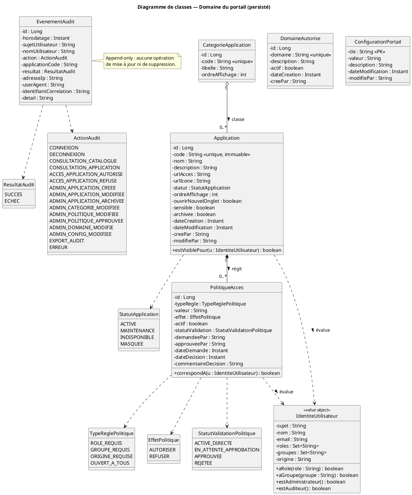

```plantuml
@startuml classes-services
title Diagramme de classes — Services applicatifs du portail
skinparam shadowing false
skinparam classAttributeIconSize 0
hide circle

class ServiceCatalogue {
  + listerApplicationsVisibles(u : IdentiteUtilisateur) : List<Application>
  + obtenirDetail(code : String, u : IdentiteUtilisateur) : Application
}

class ServiceControleAcces {
  + evaluer(u : IdentiteUtilisateur, app : Application) : DecisionAcces
}

class ServiceAcces {
  + preparerRedirection(code : String, u : IdentiteUtilisateur) : UrlRedirection
}

class ValidateurUrlCible {
  + estAutorisee(url : String) : boolean
}

class ServiceAdministrationCatalogue {
  + creerApplication(cmd : CommandeApplication, u : IdentiteUtilisateur) : Application
  + modifierApplication(code : String, cmd : CommandeApplication, u : IdentiteUtilisateur) : Application
  + archiverApplication(code : String, u : IdentiteUtilisateur) : void
  + enregistrerCategorie(cmd : CommandeCategorie, u : IdentiteUtilisateur) : CategorieApplication
  + enregistrerDomaineAutorise(cmd : CommandeDomaine, u : IdentiteUtilisateur) : DomaineAutorise
}

class ServicePolitiqueAcces {
  + ajouterPolitique(codeApp : String, cmd : CommandePolitique, u : IdentiteUtilisateur) : PolitiqueAcces
  + approuverPolitique(id : Long, u : IdentiteUtilisateur) : PolitiqueAcces
  + rejeterPolitique(id : Long, motif : String, u : IdentiteUtilisateur) : PolitiqueAcces
  + simuler(codeApp : String, roleOuGroupe : String) : DecisionAcces
}

class ServiceConfiguration {
  + lire(cle : String) : ConfigurationPortail
  + mettreAJour(cle : String, valeur : String, u : IdentiteUtilisateur) : void
}

class ServiceAudit {
  + journaliser(e : EvenementAudit) : void
  + rechercher(critere : CritereAudit, u : IdentiteUtilisateur) : Page
  + exporter(critere : CritereAudit, u : IdentiteUtilisateur) : FluxExport
}

class DecisionAcces <<value object>> {
  - autorise : boolean
  - motif : MotifRefus
  - applicationBloquee : boolean
}

enum MotifRefus {
  NON_AUTHENTIFIE
  APPLICATION_MASQUEE
  APPLICATION_ARCHIVEE
  APPLICATION_INDISPONIBLE
  POLITIQUE_REFUS
  AUCUNE_POLITIQUE_AUTORISANTE
  URL_NON_CONFORME
}

class "Application" as Application <<domaine>>
class "PolitiqueAcces" as PolitiqueAcces <<domaine>>
class "CategorieApplication" as CategorieApplication <<domaine>>
class "DomaineAutorise" as DomaineAutorise <<domaine>>
class "ConfigurationPortail" as ConfigurationPortail <<domaine>>
class "EvenementAudit" as EvenementAudit <<domaine>>

ServiceCatalogue ..> ServiceControleAcces
ServiceCatalogue ..> Application
ServiceCatalogue ..> ServiceAudit

ServiceControleAcces ..> PolitiqueAcces
ServiceControleAcces ..> Application
ServiceControleAcces ..> DecisionAcces
ServiceControleAcces ..> MotifRefus

ServiceAcces ..> ServiceControleAcces
ServiceAcces ..> ValidateurUrlCible
ServiceAcces ..> ServiceAudit
ServiceAcces ..> Application

ValidateurUrlCible ..> DomaineAutorise

ServiceAdministrationCatalogue ..> Application
ServiceAdministrationCatalogue ..> CategorieApplication
ServiceAdministrationCatalogue ..> DomaineAutorise
ServiceAdministrationCatalogue ..> ValidateurUrlCible
ServiceAdministrationCatalogue ..> ServiceAudit

ServicePolitiqueAcces ..> PolitiqueAcces
ServicePolitiqueAcces ..> Application
ServicePolitiqueAcces ..> ServiceControleAcces
ServicePolitiqueAcces ..> ServiceAudit

ServiceConfiguration ..> ConfigurationPortail
ServiceConfiguration ..> ServiceAudit

ServiceAudit ..> EvenementAudit
@enduml
```

# Diagramme de classes — Portail Applicatif du Ministère

Statut : **Étape 3 / 8 — Diagramme de classes** (domaine persisté + services applicatifs).

S'appuie sur : [03-modelisation.md](03-modelisation.md) (modèle du domaine §7),
[05-cas-utilisation.md](05-cas-utilisation.md) (fiches UC01–UC11).

Portée : **le portail uniquement**. Aucune classe métier d'EDUSN ou du Restaurant.

## Décisions appliquées (questions ouvertes de l'étape 2)

| # | Décision retenue | Traduction dans le modèle |
|---|---|---|
| Q1 | Rôle d'audit dédié `PORTAL_AUDITOR`, distinct de `PORTAL_ADMIN` | `IdentiteUtilisateur.estAuditeur()` ; `ActionAudit.EXPORT_AUDIT` ; garde sur `ServiceAudit.exporter()` |
| Q2 | Double validation (« quatre yeux ») pour les politiques d'accès des applications **sensibles** | `Application.sensible` + champs de workflow sur `PolitiqueAcces` (`statutValidation`, `demandeePar`, `approuveePar`, …) |
| Q3 | Journal d'audit : consultation **et** export depuis l'IHM, l'export étant lui-même journalisé | `ServiceAudit.exporter()` + `ActionAudit.EXPORT_AUDIT` |
| Q4 | Ré-authentification *step-up* sur les opérations critiques uniquement | Traité à la couche sécurité / BFF (étape 8), pas dans les classes du domaine |
| Q5 | Pas de préférences utilisateur en v1 | Aucune classe `PreferenceUtilisateur` |

---

## 1. Diagramme de classes — Domaine du portail (persisté)

**Nom.** Modèle du domaine du portail (entités persistées en base MySQL `portail_db`).

**Objectif.** Définir les données que le portail détient en propre : le catalogue
d'applications, leur catégorisation, les politiques d'accès de niveau portail, la liste blanche
de domaines de redirection, le journal d'audit, la configuration.

**Description.** Six entités persistées, un objet valeur non persisté (`IdentiteUtilisateur`,
projection des *claims* Keycloak), et les énumérations associées. Le portail **ne détient aucun
compte utilisateur** (RG02).

**Éléments.**

| Classe | Responsabilité | Persistée |
|---|---|---|
| `Application` | Entrée générique du catalogue : métadonnées + URL d'accès + statut | Oui — `application` |
| `CategorieApplication` | Regroupement d'applications pour l'affichage | Oui — `categorie_application` |
| `PolitiqueAcces` | Règle « qui voit / peut accéder » à une application, au niveau portail, avec workflow de validation | Oui — `politique_acces` |
| `DomaineAutorise` | Liste blanche des domaines vers lesquels une redirection est permise (RG08) | Oui — `domaine_autorise` |
| `EvenementAudit` | Événement d'audit horodaté, **append-only** | Oui — `evenement_audit` |
| `ConfigurationPortail` | Paramètre clé/valeur (titre, bannière, liens, mentions) | Oui — `configuration_portail` |
| `IdentiteUtilisateur` | Projection des *claims* du jeton : identité + rôles + groupes + origine | **Non** (objet valeur, reconstruit à chaque requête) |

**Relations.**

- `CategorieApplication` **1** ○—— **0..\*** `Application` (agrégation : une application peut
  exister sans catégorie ; supprimer une catégorie référencée est interdit — UC08/E1).
- `Application` **1** ◆—— **0..\*** `PolitiqueAcces` (composition : une politique n'a pas de
  sens hors de son application ; suit le cycle de vie de l'application).
- `DomaineAutorise` est autonome : référencé par un **service** (`ValidateurUrlCible`), pas par
  une association d'entité, pour éviter un couplage fort entre `Application` et la liste
  blanche.
- `PolitiqueAcces` et `Application` **utilisent** `IdentiteUtilisateur` (dépendance
  d'évaluation, non une association persistée).

**Justification des choix.**

- **Aucune classe `Utilisateur` persistée** : l'identité vient exclusivement du jeton Keycloak
  (RG02). `IdentiteUtilisateur` est un objet valeur, jamais stocké.
- **`DomaineAutorise` est une entité**, pas une constante de configuration : RG08 impose une
  liste blanche **administrable et auditée** ; toute modification passe par UC07 et génère
  `ADMIN_DOMAINE_MODIFIE`.
- **Énumérations** (`StatutApplication`, `TypeReglePolitique`, `EffetPolitique`,
  `StatutValidationPolitique`, `ResultatAudit`) pour les ensembles de valeurs **fermés** ;
  `ActionAudit` reprend exactement les actions citées dans les fiches UC.
- **Workflow de validation porté par des champs de `PolitiqueAcces`** (`statutValidation`,
  `demandeePar`, `approuveePar`, `dateDemande`, `dateDecision`, `commentaireDecision`) plutôt
  qu'une classe `DemandeValidation` séparée : le workflow est simple (deux pas : demande →
  décision). *Alternative documentée* : extraire une classe dédiée si le workflow s'enrichit
  (plusieurs validateurs, historique multi-étapes).
- **`EvenementAudit` est append-only** : aucune méthode ni API de mise à jour / suppression
  (note explicite sur le diagramme). Immuabilité exigée pour une application de l'État.
- **`Application.sensible`** : marqueur qui déclenche la double validation des politiques
  (Q2) et pourra moduler d'autres exigences (journalisation renforcée).
- **Suppression logique** (`Application.archivee`) et jamais physique (RG12), pour préserver
  l'intégrité référentielle du journal d'audit (qui ne référence l'application que par `code`).

**Code PlantUML.**

**Vérification de cohérence.**

- Chaque entité correspond à une entité du §7 de la modélisation (aucune classe ajoutée sans
  justification : `DomaineAutorise` est la traduction de RG08).
- Les champs de workflow de `PolitiqueAcces` répondent à Q2 ; `IdentiteUtilisateur.estAuditeur()`
  répond à Q1.
- `ActionAudit` couvre toutes les actions nommées dans les fiches UC (y compris
  `ADMIN_POLITIQUE_APPROUVEE`, `ADMIN_DOMAINE_MODIFIE`, `EXPORT_AUDIT`).
- Aucune classe `Eleve`, `Professeur`, `Menu`, `Commande`, `Caisse`… : périmètre respecté.

---

## 2. Diagramme de classes — Services applicatifs

**Nom.** Services applicatifs du portail et leurs collaborations.

**Objectif.** Montrer où se trouve la logique : entités volontairement minces, comportement
porté par des services applicatifs (`@Service` Spring), conformément à la structure du backend
(étape 6).

**Description.** Sept services + deux objets valeur de résultat (`DecisionAcces`,
`UrlRedirection`) + l'énumération `MotifRefus`. `ServiceControleAcces` est l'implémentation du
cas transverse « Contrôler l'autorisation d'accès » ; `ServiceAudit` celle de « Journaliser un
événement d'audit ».

**Éléments.**

| Service | Rôle | Cas d'utilisation |
|---|---|---|
| `ServiceCatalogue` | Lister les applications visibles, obtenir un détail | UC03, UC04 |
| `ServiceControleAcces` | Évaluer l'autorisation d'un utilisateur sur une application | UC03, UC04, UC05, UC09 (transverse) |
| `ServiceAcces` | Préparer la redirection vers une application (contrôle + validation URL + audit) | UC05 |
| `ValidateurUrlCible` | Vérifier qu'une URL est `https` et que son domaine est en liste blanche | UC05, UC07 |
| `ServiceAdministrationCatalogue` | CRUD des applications et des catégories | UC07, UC08 |
| `ServicePolitiqueAcces` | Créer / approuver / simuler des politiques d'accès | UC09 |
| `ServiceConfiguration` | Lire et mettre à jour la configuration du portail | UC10 |
| `ServiceAudit` | Journaliser, rechercher, exporter les événements | UC11 + transverse |

**Relations.** Dépendances `..>` (un service utilise une entité du domaine ou un autre
service). Aucun cycle. `ServiceAcces`, `ServiceAdministrationCatalogue`, `ServicePolitiqueAcces`
et `ServiceConfiguration` dépendent tous de `ServiceAudit` (journalisation obligatoire).

**Justification des choix.**

- **Entités anémiques + services** : aligné sur Spring (`@Entity` / `@Repository` /
  `@Service`), facilite les tests unitaires du contrôle d'accès et de la validation d'URL.
- **`ServiceControleAcces` isolé** : réutilisé par le filtrage du catalogue (UC03), la
  revérification du détail (UC04), l'accès effectif (UC05) et la simulation (UC09). Un seul
  point de vérité pour la règle « `REFUSER` prime, sinon `AUTORISER`/`OUVERT_A_TOUS` ».
- **`ValidateurUrlCible` séparé** : la protection anti *open redirect* (RG07/RG08) est un
  contrôle de sécurité critique, testé isolément, appelé à la fois à la configuration (UC07) et
  avant chaque redirection (UC05).
- **`DecisionAcces` + `MotifRefus`** : le motif de refus est renvoyé aux services (pour l'audit
  et le blocage) mais **jamais** exposé tel quel à l'utilisateur (message neutre — UC05/E1).
- **Objets de transfert** (`CommandeApplication`, `CommandePolitique`, `CritereAudit`,
  `UrlRedirection`, `FluxExport`, `Page<T>`) : cités pour la complétude, détaillés dans les
  contrats d'API à l'étape 6.

**Code PlantUML.**

**Vérification de cohérence.**

- Chaque service est rattaché à au moins un cas d'utilisation (tableau ci-dessus).
- `ServiceControleAcces` et `ServiceAudit` implémentent les deux cas transverses de l'étape 2.
- Aucune dépendance circulaire.
- `MotifRefus` est aligné avec les exceptions E1–E4 de UC05 et l'algorithme §7.4 de la
  modélisation.

---

## 3. Correspondance classes → tables (préparation étape 5)

| Classe | Table MySQL | Clé | Remarques |
|---|---|---|---|
| `Application` | `application` | `id` (auto), `code` unique | `archivee` pour la suppression logique |
| `CategorieApplication` | `categorie_application` | `id` (auto), `code` unique | |
| `PolitiqueAcces` | `politique_acces` | `id` (auto) | FK `application_id` ; index sur (`application_id`, `actif`) |
| `DomaineAutorise` | `domaine_autorise` | `id` (auto), `domaine` unique | |
| `EvenementAudit` | `evenement_audit` | `id` (auto) | Table en écriture seule ; index sur `horodatage`, `sujet_utilisateur`, `action`, `application_code` |
| `ConfigurationPortail` | `configuration_portail` | `cle` (naturelle) | |
| `IdentiteUtilisateur` | — | — | Objet valeur, non persisté |
| Services, `DecisionAcces`, `MotifRefus` | — | — | Logique applicative |

## 4. Correspondance classes → cas d'utilisation (traçabilité)

| Classe / service | UC couverts |
|---|---|
| `Application` | UC03, UC04, UC05, UC07 |
| `CategorieApplication` | UC03, UC08 |
| `PolitiqueAcces` | UC03, UC05, UC09 |
| `DomaineAutorise` | UC05, UC07 |
| `EvenementAudit` | tous (journalisation), UC11 |
| `ConfigurationPortail` | UC10, affichage global |
| `IdentiteUtilisateur` | UC01, UC03–UC06, contrôle d'accès |
| `ServiceCatalogue` | UC03, UC04 |
| `ServiceControleAcces` | UC03, UC04, UC05, UC09 |
| `ServiceAcces` | UC05 |
| `ValidateurUrlCible` | UC05, UC07 |
| `ServiceAdministrationCatalogue` | UC07, UC08 |
| `ServicePolitiqueAcces` | UC09 |
| `ServiceConfiguration` | UC10 |
| `ServiceAudit` | UC11 + journalisation transverse |

## 5. Vérification de cohérence globale (étape 3)

- **Besoins → classes** : chaque classe est reliée à au moins un cas d'utilisation et une
  règle de gestion ; aucune classe orpheline.
- **Classes → données** : chaque entité a une table cible (§3) ; le script de l'étape 5 en
  sera la traduction directe, sans table supplémentaire.
- **Périmètre** : aucune classe ne porte de logique métier d'EDUSN ou du Restaurant ; aucune
  classe `Utilisateur` persistée (RG02).
- **Sécurité** : la protection anti *open redirect* (`ValidateurUrlCible` + `DomaineAutorise`),
  le contrôle d'accès serveur (`ServiceControleAcces`), l'audit immuable (`EvenementAudit`
  append-only) et la séparation des rôles (Q1, Q2) sont explicitement modélisés.
- **Diagrammes de séquence (étape 4)** : les classes et services suffisent à décrire les 7
  séquences prévues (matrice §3.3 de l'étape 2).
