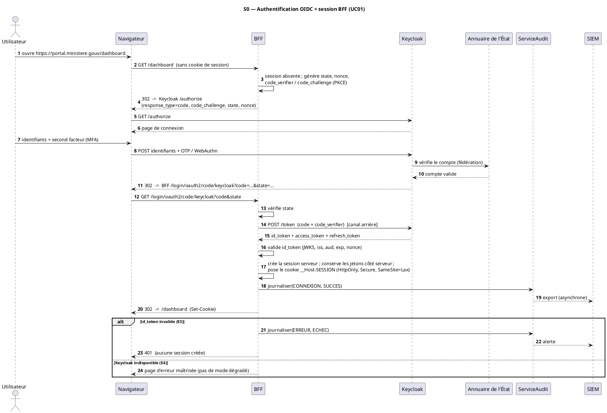
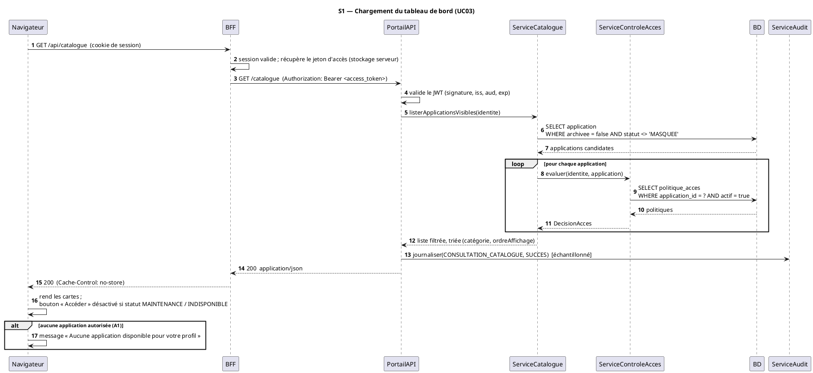
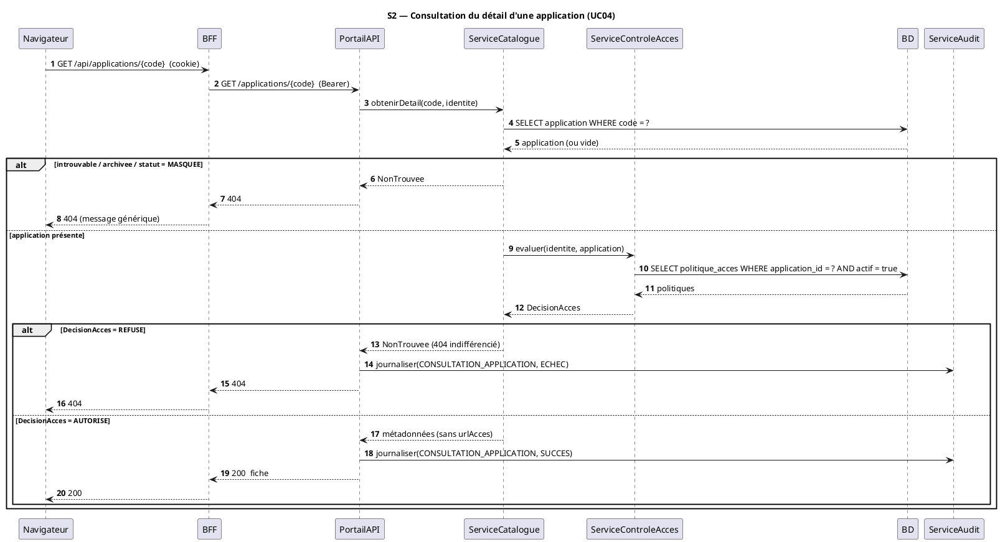
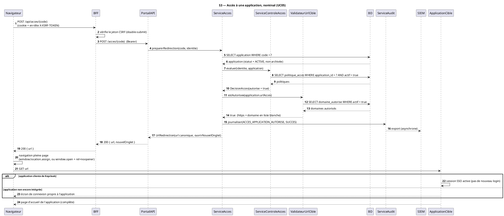
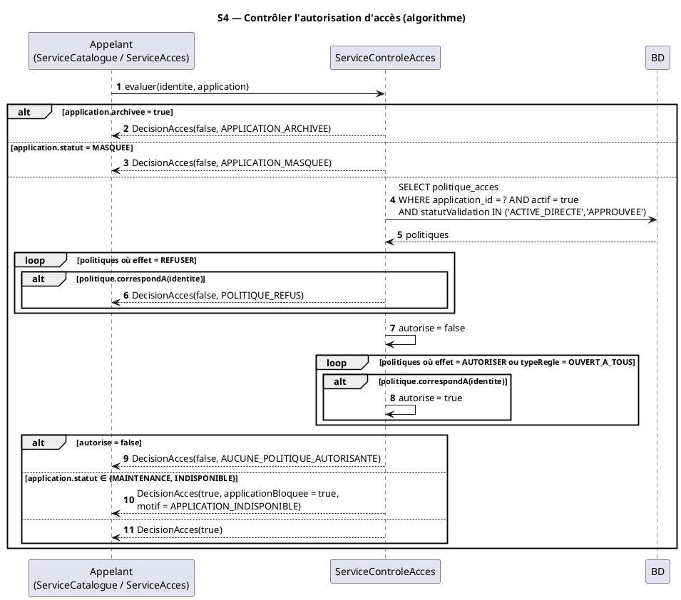
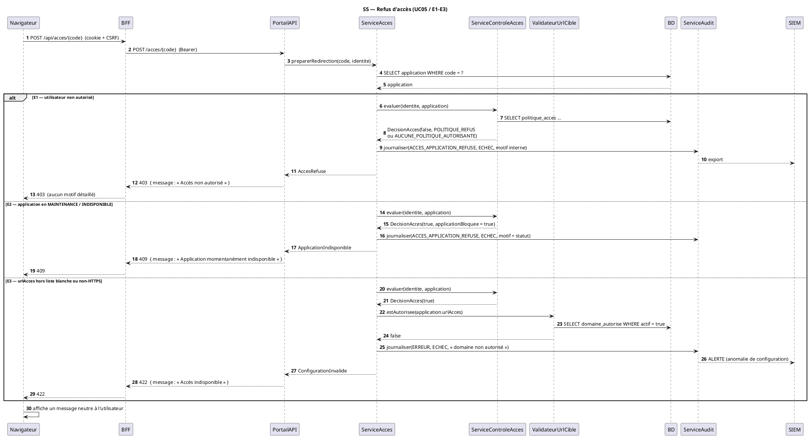
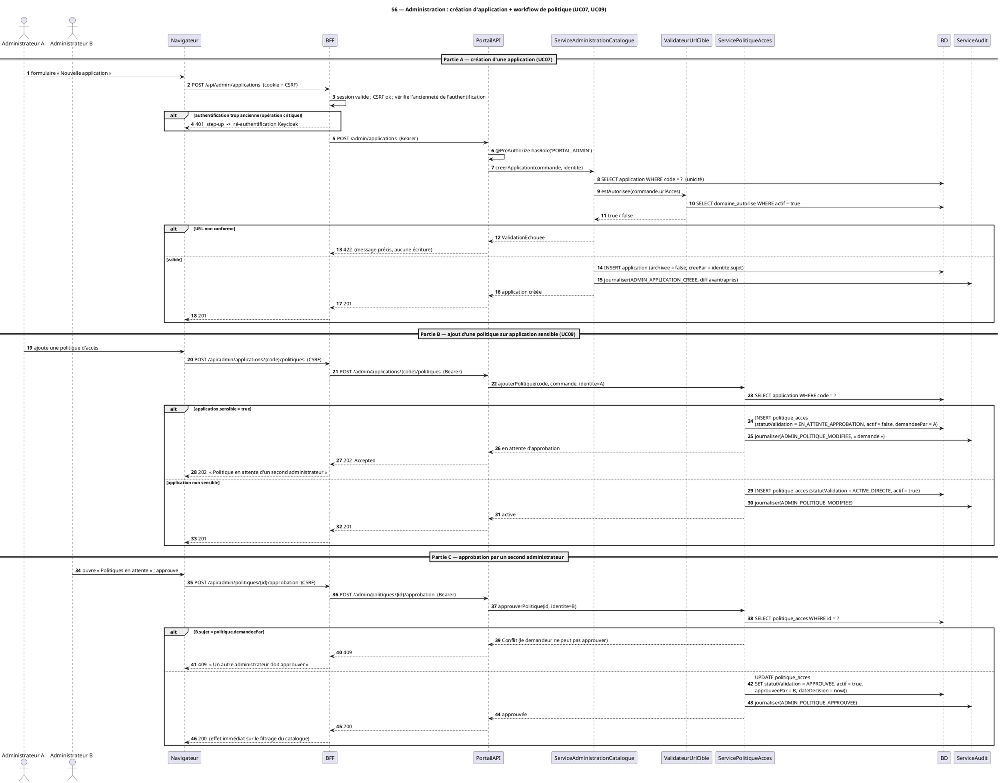

# Diagrammes de séquence — Portail Applicatif du Ministère

Statut : **Étape 4 / 8 — Diagrammes de séquence**.

S'appuie sur : [05-cas-utilisation.md](05-cas-utilisation.md) (UC01–UC11),
[06-diagramme-classes.md](06-diagramme-classes.md) (entités et services).

Sept séquences :

| # | Séquence | Cas d'utilisation |
|---|---|---|
| S0 | Authentification OIDC + établissement de session BFF | UC01 |
| S1 | Arrivée sur le portail — chargement du tableau de bord | UC03 |
| S2 | Consultation du détail d'une application | UC04 |
| S3 | Accès à une application — scénario nominal | UC05 |
| S4 | Contrôler l'autorisation d'accès — zoom sur l'algorithme | UC05, UC03, transverse |
| S5 | Refus d'accès | UC05 (E1–E3) |
| S6 | Administration — création d'application + workflow de politique | UC07, UC09 |

**Participants récurrents.**

| Participant | Rôle |
|---|---|
| `Navigateur` | Angular SPA (aucun jeton stocké) |
| `BFF` | Spring Cloud Gateway : session, cookie, CSRF, relais du jeton d'accès |
| `PortailAPI` | Spring Boot Resource Server : valide le JWT, héberge les services |
| `Keycloak` | Fournisseur d'identité (realm `ministere`) |
| `BD` | Base MySQL `portail_db` |
| `ServiceAudit` | Journalisation append-only + export SIEM |
| `SIEM` | Puits de journaux de l'État (réception asynchrone) |
| `ApplicationCible` | EDUSN, Restaurant, … (intégrées en fin de projet) |

---

## S0 — Authentification OIDC + établissement de session BFF (UC01)

**Objectif.** Établir une session authentifiée sans jamais exposer de jeton au navigateur.

**Description.** Flux OpenID Connect **Authorization Code + PKCE**. Le BFF génère `state`,
`nonce` et le couple PKCE, échange le `code` par canal arrière, valide l'`id_token`, crée une
session serveur et pose un cookie `__Host-` opaque.

**Justification.** PKCE + `state` + `nonce` couvrent l'interception de code, le CSRF de
connexion et le rejeu. Le stockage serveur des jetons neutralise le vol par XSS.

**Vérification.** Aucun jeton transite vers `Navigateur`. `state` et `nonce` vérifiés.
Journalisation systématique (RG13). Couvre A1 (SSO déjà actif), A2 (enrôlement MFA par
Keycloak), E1/E2 (gérés par Keycloak), E3, E4.

---

## S1 — Arrivée sur le portail : chargement du tableau de bord (UC03)

**Objectif.** Renvoyer **uniquement** les applications visibles par l'utilisateur, triées.

**Description.** Le BFF relaie l'appel au `PortailAPI` avec le jeton d'accès. `ServiceCatalogue`
charge les applications candidates puis délègue à `ServiceControleAcces` pour chacune.

**Justification.** Le filtrage est **serveur** (RG03, RG09) ; la réponse est `no-store` car
personnalisée.

**Vérification.** `ServiceControleAcces` réutilisé (cohérent avec S4). Applications `MASQUEE`
jamais renvoyées (RG04). Aucun cache d'autorisation (E1).

---

## S2 — Consultation du détail d'une application (UC04)

**Objectif.** Afficher la fiche d'une application, avec **revérification** de visibilité.

**Description.** Réponse **404 indifférenciée** si l'application est inconnue, archivée,
`MASQUEE` ou non autorisée (pas d'énumération).

**Vérification.** 404 identique pour « inexistante » et « interdite » (UC04/E1). `urlAcces` non
exposée à ce stade.

---

## S3 — Accès à une application : scénario nominal (UC05)

**Objectif.** Contrôler l'accès, valider l'URL cible, journaliser, puis rediriger en pleine
page.

**Description.** Requête **mutable** → jeton CSRF exigé. La destination provient **uniquement**
du catalogue et est revalidée contre la liste blanche (`ValidateurUrlCible` +
`DomaineAutorise`).

**Vérification.** Anti *open redirect* (RG07/RG08) : `ValidateurUrlCible` appelé avant toute
redirection. Aucune `iframe`. Journalisation avant la réponse. Couvre A1/A2/A3.

---

## S4 — Contrôler l'autorisation d'accès : zoom sur l'algorithme (transverse)

**Objectif.** Détailler la règle d'évaluation, réutilisée par S1, S2, S3, S5 et UC09.

**Description.** Ordre : archivage → `MASQUEE` → politiques `REFUSER` (priorité) → politiques
`AUTORISER` / `OUVERT_A_TOUS` → statut de disponibilité. Seules les politiques
`ACTIVE_DIRECTE` ou `APPROUVEE` sont prises en compte (workflow Q2).

**Vérification.** `REFUSER` prime (RG cohérente avec UC09). `MotifRefus` aligné avec le
diagramme de classes (§2 de l'étape 3). Prend en compte le workflow de validation (Q2).

---

## S5 — Refus d'accès (UC05, exceptions E1–E3)

**Objectif.** Refuser proprement : message **neutre** à l'utilisateur, motif réel **journalisé
seulement**.

**Vérification.** Le `MotifRefus` n'est jamais renvoyé au client (UC05/E1). E3 déclenche une
**alerte SIEM** (anomalie de configuration, pas simple refus métier).

---

## S6 — Administration : création d'application + workflow de politique (UC07, UC09)

**Objectif.** Montrer les contrôles d'administration : RBAC `PORTAL_ADMIN`, *step-up*,
validation d'URL, audit avant/après, et la **double validation** des politiques sur application
sensible (Q2).

**Vérification.** RBAC serveur (`@PreAuthorize`), *step-up* pour opérations critiques (Q4),
validation d'URL réutilisée (cohérent avec S3), audit avec valeurs avant/après (RG14),
séparation demandeur / approbateur (Q2). `ActionAudit.ADMIN_POLITIQUE_APPROUVEE` cohérent avec
le diagramme de classes.

---

## Vérification de cohérence globale (étape 4)

- **Séquences → cas d'utilisation** : S0↔UC01, S1↔UC03, S2↔UC04, S3/S4/S5↔UC05, S6↔UC07+UC09.
  Les 7 séquences de la matrice §3.3 de l'étape 2 sont produites.
- **Séquences → classes** : seuls les services et entités de l'étape 3 apparaissent
  (`ServiceCatalogue`, `ServiceControleAcces`, `ServiceAcces`, `ValidateurUrlCible`,
  `ServicePolitiqueAcces`, `ServiceAdministrationCatalogue`, `ServiceAudit` ; entités via `BD`).
- **Séquences → règles de gestion** : RG01/RG02 (S0), RG03/RG04/RG09 (S1/S2/S4), RG05/RG06/
  RG07/RG08/RG13 (S3/S5), RG10/RG11/RG14 (S6), RG16 (S4, via `ORIGINE_REQUISE`).
- **Périmètre** : `ApplicationCible` n'apparaît que comme destination d'une **redirection**
  (S3) ; aucune séquence n'appelle une API métier ni une base d'application cible.
- **Sécurité** : PKCE + `state` + `nonce` (S0), filtrage serveur (S1), 404 indifférencié (S2),
  anti open-redirect (S3/S5), message neutre + motif journalisé (S5), RBAC + step-up + quatre
  yeux (S6).
- **Prochaine étape (5 — base de données)** : les colonnes et index évoqués dans `BD`
  (notamment `politique_acces(application_id, actif, statutValidation)` et
  `evenement_audit(horodatage, sujet_utilisateur, action, application_code)`) seront la base du
  script DDL MySQL.
