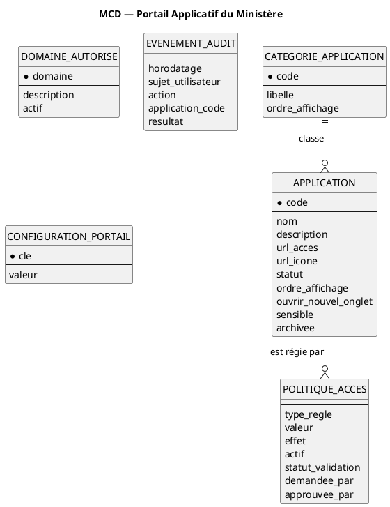

# Base de données — Portail Applicatif du Ministère

Statut : **Étape 5 / 8 — Base de données** (MCD → MLD → script MySQL → connexion → migrations).

S'appuie sur : [06-diagramme-classes.md](06-diagramme-classes.md) (§3 correspondance classes →
tables), [07-diagrammes-sequence.md](07-diagrammes-sequence.md) (index évoqués dans `BD`).

SGBD : **MySQL 8.0+**, moteur **InnoDB**, jeu de caractères **utf8mb4**. Conception et
administration avec **MySQL Workbench**. Base **dédiée au portail** (`portail_db`),
**strictement séparée** des bases d'EDUSN et du Restaurant (contrainte d'indépendance).

Livrables associés :

| Fichier | Contenu |
|---|---|
| [../infra/db/portail_db.sql](../infra/db/portail_db.sql) | Base + comptes + tables + triggers append-only + **données de référence** |
| [../infra/db/donnees-demo.sql](../infra/db/donnees-demo.sql) | Applications fictives + politiques (dev / recette **uniquement**) |
| [../infra/docker-compose.yml](../infra/docker-compose.yml) | Service `mysql-portail` (option Docker) |

---

## 0. Réconciliation des noms de rôles

Le realm Keycloak du dépôt ([../infra/keycloak/realm-export.json](../infra/keycloak/realm-export.json))
définit `AGENT`, `GESTIONNAIRE_HABILITATIONS`, `ADMIN_PORTAIL`. Les étapes 2–4 employaient
`PORTAL_ADMIN` / `PORTAL_AUDITOR` : **on retient désormais les noms du realm**.

| Concept | Rôle realm retenu | Remarque |
|---|---|---|
| Utilisateur authentifié de base | `AGENT` | Toute personne habilitée à ouvrir le portail |
| Administration du portail | `ADMIN_PORTAIL` | Catalogue, catégories, politiques, configuration |
| Consultation de l'audit (Q1) | `AUDITEUR_PORTAIL` | **à ajouter au realm** |
| Gestion des politiques d'accès (option) | `GESTIONNAIRE_HABILITATIONS` | Existe déjà ; en v1 `ADMIN_PORTAIL` suffit |

Ces libellés sont ceux stockés dans `politique_acces.valeur` quand `type_regle = 'ROLE_REQUIS'`.

---

## 1. Modèle Conceptuel de Données (MCD)

**Objectif.** Représenter les concepts persistés du portail et leurs associations, sans détail
technique.

**Entités et associations.**

- Une **CATÉGORIE** regroupe 0..\* **APPLICATION** ; une application appartient à 0..1 catégorie.
- Une **APPLICATION** est régie par 0..\* **POLITIQUE D'ACCÈS** ; une politique porte sur
  exactement 1 application.
- Un **DOMAINE AUTORISÉ** est autonome (liste blanche consultée par le service de validation
  d'URL ; aucune association de données avec APPLICATION, pour éviter un couplage fort).
- Un **ÉVÉNEMENT D'AUDIT** référence une application par son `code` (référence **faible**,
  volontairement non contrainte : l'audit survit à l'archivage d'une application).
- **CONFIGURATION PORTAIL** : paramètres clé/valeur autonomes.
- **IdentiteUtilisateur** n'est **pas** persistée (projection du jeton Keycloak — RG02).



---

## 2. Modèle Logique de Données (MLD)

Notation : `PK` clé primaire, `FK` clé étrangère, `U` contrainte d'unicité, `IX` index.

```
categorie_application (
  id              PK,
  code            U, NOT NULL,
  libelle         NOT NULL,
  ordre_affichage NOT NULL DEFAULT 0,
  date_creation   NOT NULL
)

application (
  id                   PK,
  code                 U, NOT NULL,           -- immuable applicativement (RG11)
  nom                  NOT NULL,
  description          NOT NULL DEFAULT '',
  url_acces            NOT NULL,              -- CHECK https://
  url_icone            NULL,                  -- CHECK https:// si non nul
  categorie_id         FK -> categorie_application(id)  ON DELETE RESTRICT,
  statut               NOT NULL DEFAULT 'MASQUEE',  -- ENUM
  ordre_affichage      NOT NULL DEFAULT 0,
  ouvrir_nouvel_onglet NOT NULL DEFAULT 0,
  sensible             NOT NULL DEFAULT 0,
  archivee             NOT NULL DEFAULT 0,    -- suppression logique (RG12)
  date_creation        NOT NULL,
  date_modification    NOT NULL,
  cree_par             NOT NULL,
  modifie_par          NOT NULL,
  IX (categorie_id),
  IX (archivee, statut, ordre_affichage)      -- listing du catalogue (S1)
)

politique_acces (
  id                   PK,
  application_id        FK -> application(id)  ON DELETE CASCADE,
  type_regle           NOT NULL,              -- ENUM
  valeur               NULL,                  -- CHECK: NULL ssi OUVERT_A_TOUS
  effet                NOT NULL DEFAULT 'AUTORISER',  -- ENUM
  actif                NOT NULL DEFAULT 0,
  statut_validation    NOT NULL DEFAULT 'ACTIVE_DIRECTE',  -- ENUM (workflow Q2)
  demandee_par         NOT NULL,
  approuvee_par         NULL,                 -- CHECK: renseigné si APPROUVEE
  date_demande         NOT NULL,
  date_decision        NULL,
  commentaire_decision NULL,
  IX (application_id, actif, statut_validation)  -- évaluation d'accès (S4)
)

domaine_autorise (
  id            PK,
  domaine       U, NOT NULL,                  -- CHECK format DNS
  description   NOT NULL DEFAULT '',
  actif         NOT NULL DEFAULT 1,
  date_creation NOT NULL,
  cree_par      NOT NULL
)

evenement_audit (                             -- APPEND ONLY (triggers)
  id                      PK,
  horodatage              NOT NULL,
  sujet_utilisateur       NULL,
  nom_utilisateur         NULL,
  action                  NOT NULL,           -- VARCHAR(40), ensemble ouvert
  application_code        NULL,               -- référence faible (pas de FK)
  resultat                NOT NULL,           -- ENUM SUCCES / ECHEC
  adresse_ip              NULL,
  user_agent              NULL,
  identifiant_correlation NULL,
  detail                  NULL,               -- JSON
  IX (horodatage),
  IX (sujet_utilisateur, horodatage),
  IX (action, horodatage),
  IX (application_code, horodatage)
)

configuration_portail (
  cle               PK,
  valeur            NOT NULL DEFAULT '',
  description       NOT NULL DEFAULT '',
  date_modification NOT NULL,
  modifie_par       NOT NULL
)
```

**Choix de conception justifiés.**

| Choix | Raison |
|---|---|
| `id BIGINT UNSIGNED AUTO_INCREMENT` en PK technique, `code` en clé métier `U` | Découple les FK de la clé métier ; `code` reste lisible et stable (RG11) |
| **Pas de table `utilisateur`** | Identité déléguée à Keycloak (RG02) ; `*_par` stockent le `sub` / nom |
| `ENUM` pour `statut`, `type_regle`, `effet`, `statut_validation`, `resultat` | Ensembles **fermés** ; lisibles dans Workbench ; contrôle au niveau SGBD |
| `action` en `VARCHAR(40)` (pas `ENUM`) | Ensemble **ouvert** : de nouvelles actions d'audit apparaîtront sans `ALTER TABLE` |
| Pas de FK `evenement_audit.application_code -> application.code` | L'audit doit survivre à l'archivage/renommage ; référence faible assumée |
| `domaine_autorise` isolé (aucune FK depuis `application`) | La liste blanche est un contrôle de sécurité transversal, pas une donnée de l'application |
| `CHECK (url_acces LIKE 'https://%')` | Défense en profondeur RG08, en complément du `ValidateurUrlCible` applicatif |
| `CHECK` cohérence `valeur` / `type_regle` et `approbation` / `statut_validation` | Empêche les états incohérents même en cas de bug applicatif |
| Index `(application_id, actif, statut_validation)` | Couvre exactement la requête d'évaluation d'accès (S4) |
| Triggers `BEFORE UPDATE/DELETE` sur `evenement_audit` | Immuabilité du journal exigée pour une application de l'État |

---

## 3. Script MySQL

Le script complet est dans **[../infra/db/portail_db.sql](../infra/db/portail_db.sql)**. Points
saillants :

- Création de `portail_db` en `utf8mb4` / `utf8mb4_0900_ai_ci`.
- **Deux comptes** :
  - `portail_app` — `SELECT, INSERT, UPDATE, DELETE` seulement (le service applicatif ne fait
    **jamais** de DDL) ;
  - `portail_migration` — tous privilèges sur `portail_db` (Flyway / Workbench).
- 6 tables + 2 triggers d'immuabilité de l'audit.
- **Données de référence** incluses (catégories, domaines `edusn.ministere.gouv` et
  `restaurant.ministere.gouv`, clés de configuration) — idempotentes (`ON DUPLICATE KEY UPDATE`).
- **Espaces réservés** `EDUSN` et `RESTAURANT` créés au statut `MASQUEE`, sans politique
  active : invisibles tant que l'intégration (client Keycloak) n'est pas réalisée.

Les mots de passe du script (`CHANGER_CE_MOT_DE_PASSE_*`) sont des **marqueurs** : les
remplacer par des secrets forts, hors dépôt Git.

---

## 4. Connexion Spring Boot ↔ MySQL

MySQL Workbench sert à **concevoir, exécuter et inspecter** ; la liaison à l'exécution se fait
par **JDBC**. Le schéma est piloté par **Flyway**, jamais par Hibernate (`ddl-auto: validate`).

`backend/portail-api/src/main/resources/application.yml` (extrait) :

```yaml
spring:
  datasource:
    url: jdbc:mysql://localhost:3306/portail_db?useSSL=true&requireSSL=true&serverTimezone=UTC&characterEncoding=UTF-8&rewriteBatchedStatements=true
    username: portail_app
    password: ${PORTAIL_DB_PASSWORD}          # variable d'environnement / coffre
    hikari:
      maximum-pool-size: 10
      minimum-idle: 2
      connection-timeout: 5000
  jpa:
    open-in-view: false
    hibernate:
      ddl-auto: validate                      # Hibernate ne modifie JAMAIS le schéma
    properties:
      hibernate.dialect: org.hibernate.dialect.MySQLDialect
      hibernate.jdbc.time_zone: UTC
  flyway:
    enabled: true
    url: jdbc:mysql://localhost:3306/portail_db
    user: portail_migration
    password: ${PORTAIL_DB_MIGRATION_PASSWORD}
    locations: classpath:db/migration
    baseline-on-migrate: false
    clean-disabled: true                      # interdit `flyway clean` en prod
```

Dépendances Maven : `mysql-connector-j`, `flyway-core`, `flyway-mysql`, `spring-boot-starter-data-jpa`.

---

## 5. Migrations Flyway (source de vérité du schéma)

`backend/portail-api/src/main/resources/db/migration/` :

| Fichier | Contenu |
|---|---|
| `V1__schema_initial.sql` | Les 6 `CREATE TABLE` + les 2 triggers (corps de `portail_db.sql` sans la partie « base + comptes ») |
| `V2__donnees_reference.sql` | Catégories, `domaine_autorise`, `configuration_portail`, espaces réservés `EDUSN` / `RESTAURANT` |
| `V3__index_complementaires.sql` | Réservé aux ajustements d'index post-charge |

Les **données de démonstration** ne sont **pas** des migrations : elles restent dans
`infra/db/donnees-demo.sql`, chargées à la main en local/recette, ou via
`spring.flyway.locations` complété par `classpath:db/demo` **uniquement** sous le profil `dev`.

**Règle :** toute évolution de schéma = **nouvelle** migration `Vn__…`. On ne modifie jamais
une migration déjà appliquée. Workbench peut servir à prototyper (mode EER), mais le diff
validé est recopié dans un fichier `Vn__…`.

---

## 6. Procédure MySQL Workbench

1. **Connexion** : `Database ▸ Manage Connections` → hôte `127.0.0.1`, port `3306`, utilisateur
   `portail_migration`. Tester la connexion.
2. **Création du schéma** : ouvrir `infra/db/portail_db.sql` (`File ▸ Open SQL Script`) →
   exécuter (`⚡`). Vérifier dans `SCHEMAS` la présence de `portail_db` et de ses 6 tables.
3. **Données de démo (local uniquement)** : ouvrir et exécuter `infra/db/donnees-demo.sql`.
4. **Modèle EER (visualisation)** : `Database ▸ Reverse Engineer…` → choisir `portail_db` →
   obtenir le diagramme entités-relations, à exporter en PNG/PDF pour le rapport.
5. **Évolution du modèle** : modifier l'EER dans Workbench → `Database ▸ Synchronize Model…`
   pour générer le script de différence → **recopier ce script dans une migration `Vn__…`**
   (Flyway reste la référence), puis appliquer via Flyway.
6. **Sauvegarde** : `Server ▸ Data Export` (schéma + données), fichier chiffré, hors dépôt.

---

## 7. Rétention et exploitation du journal d'audit

- **Immuabilité** : les triggers bloquent tout `UPDATE`/`DELETE` applicatif.
- **Rétention** : partitionner `evenement_audit` par mois sur `horodatage` (`PARTITION BY RANGE
  (TO_DAYS(horodatage))`) ; la purge se fait par `ALTER TABLE … DROP PARTITION` (opération
  d'administration, hors compte applicatif), conformément à la durée de conservation fixée par
  l'État (**à confirmer** — voir questions ouvertes).
- **Export SIEM** : chaque événement est aussi poussé vers le SIEM (asynchrone) ; la base
  MySQL n'est pas l'unique dépositaire.
- **Chiffrement au repos** : activer le chiffrement InnoDB (`innodb_redo_log_encrypt`,
  tablespaces chiffrés) ou le chiffrement de volume ; sauvegardes chiffrées.
- **Accès** : le compte `portail_app` ne peut pas lire les tables système ; la consultation
  d'audit (UC11) passe par le service applicatif avec le rôle `AUDITEUR_PORTAIL`.

---

## 8. Vérification de cohérence (étape 5)

- **Classes → tables** : les 6 entités persistées de l'étape 3 ont chacune leur table ; aucune
  table supplémentaire non justifiée (`domaine_autorise` = traduction de RG08, déjà actée à
  l'étape 3).
- **Séquences → index** : `ix_politique_eval (application_id, actif, statut_validation)` couvre
  S4 ; `ix_application_liste (archivee, statut, ordre_affichage)` couvre S1 ;
  `ix_audit_*` couvrent la recherche d'audit (UC11).
- **Règles de gestion** : RG02 (aucune table utilisateur), RG08 (`domaine_autorise` +
  `CHECK https`), RG11 (`code` unique), RG12 (`archivee`), RG13/RG14 (`evenement_audit`),
  workflow Q2 (`statut_validation`, `ck_politique_approbation`).
- **Périmètre** : aucune table métier d'EDUSN ou du Restaurant ; `portail_db` isolée des bases
  applicatives.
- **Prochaine étape (6 — backend)** : entités JPA mappées sur ces tables, `V1`/`V2` Flyway
  extraites de `portail_db.sql`, `application.yml` ci-dessus.

## 9. Questions ouvertes

| # | Question | Impact |
|---|---|---|
| Q6 | Durée de conservation du journal d'audit (12 mois ? 3 ans ? 5 ans ?) | Fixe la stratégie de partitionnement / purge |
| Q7 | `adresse_ip` : conserver l'IP complète ou tronquée/pseudonymisée (RGPD) ? | Modifie le format de la colonne et la collecte |
| Q8 | Confirmez `AUDITEUR_PORTAIL` comme nouveau rôle realm (Q1) ? | Ajout au `realm-export.json` |
